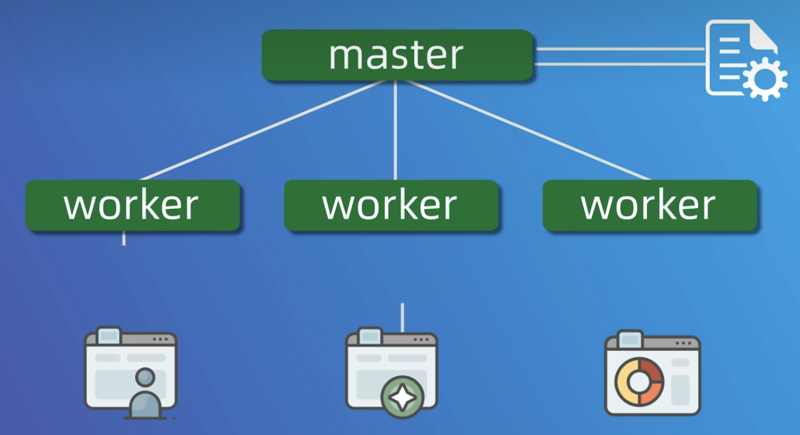
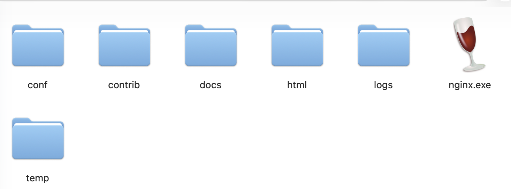
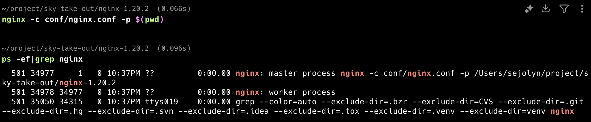

## 基础命令


```zsh
# 启动nginx（使用默认的配置文件）
nginx

# 使用指定项目的配置文件和目录
# 都是相对于当前项目根目录的
nginx -p $(pwd) -c conf/nginx.conf
# -p 静态文件目录
# -c 配置文件

# 查看当前的nginx进程
ps -ef|grep nginx

# 查看80端口的占用情况
lsof -i:80

# 停止或重启
nginx -s [signal]
# quit: 优雅停止
# stop：立即停止
# reload: 重载配置文件
# reopen: 重新打开日志文件
```


## 配置文件


nginx的进程模型：



- master 进程只有一个，负责读取和验证配置文件，以及管理 worker 进程
- worker 进程就是工作进程，负责处理具体的请求


课程资料中给的是以 `nginx.exe`的形式给出的，其配置目录为conf，里面有默认的静态站点页面：


在Mac上可以通过Window Stable来运行`.exe`文件，也可以使用 `nginx -p $(pwd) -c conf/nginx.conf`命令，用自己的nginx来运行该配置：




可以看到，此时nginx的master进程，加载的就是资料中给的配置文件。


## 反向代理


- 场景：
	- 前端网页运行在浏览器里，访问的是 `http://localhost/api/employee/login`（默认80端口）。
	- 后端代码运行在 IDEA 中，监听的是 `8080` 端口
- 问题：前端发送的请求，后端是如何接收到的？
- Nginx：将对请求地址的访问转发给指定地址（后端服务器）


```nginx
server {
	listen       80;
	server_name  localhost;

	# 反向代理,处理管理端发送的请求
	location /api/ {
		proxy_pass   http://localhost:8080/admin/;
	}
}
```


配置详解（`nginx.conf`）：

- 监听（`listen 80`）：nginx 监听访问地址为 `localhost` 的 `80` 端口（浏览器的请求）
- 反向代理（`prxy_pass`）：将监听到以 `/api/` 开头的请求路径后，转发给指定的地址 `http://localhost:8080/admin/`


反向代理的好处：
- 提高访问速度：nginx 本身可以**缓存数据**，如果访问同一接口，nginx 可以直接返回已缓存的数据，不需要再去访问服务端
- **负载均衡**：把大量的请求按照指定的方式分配给集群中的每台服务器
- **保证后端服务安全**：服务端地址一般不会泄漏，所以不能使用浏览器直接访问


## 负载均衡


如果服务器以集群的方式进行部署，那么 nginx 在转发请求到服务器时需要进行**负载均衡**。


通过 `upstream` 来配置后端服务器组：

```nginx
upstream webservers{
    server 192.168.100.128:8080;
    server 192.168.100.129:8080;
}
server{
    listen 80;
    server_name localhost;
    
    location /api/{
        proxy_pass http://webservers/admin;#负载均衡
    }
}
```


负载均衡有很多策略，但是对于只有一个服务器的该项目，默认的「轮询」已经足够。


## 参考


- Nginx学习：[【GeekHour】30分钟Nginx入门教程](https://www.bilibili.com/video/BV1mz4y1n7PQ/?vd_source=74ec4f72a4bfcd8ce6aa18434e22e349)
