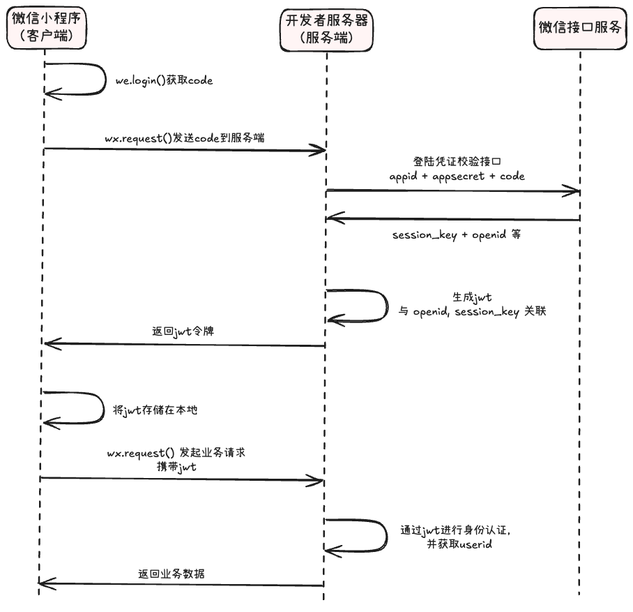

## code（临时登陆凭证）

> 为什么需要 code？

因为前端是不可信的，其可能伪造大量的假用户来占用服务端资源。

> code 是如何生成的？

1. 当用户进入小程序后并点击登陆后，小程序会调用 `wx.login()`，向**微信客户端内核**发起请求，表示“我要登陆”
2. 微信客户端内核收到请求后，会进行一次加密网络通信，将用户信息发送到**微信服务端**
3. 微信服务端生成一个 **code**（包含了加密信息和时效性）
4. 微信客户端将 code 返回给小程序，小程序才能去请求服务端

## 登陆凭证校验

后端收到 login 请求并拿到 code 后，其会调用 `auth.code2Session` 接口去请求微信接口服务，返回 `session_key` 和 `openid`。

- `session_key`：**会话密钥**。如果后续需要用户的其他信息（比如电话号码），微信会加密传输，后端需要用该密钥解密
- `openid`：**用户的唯一身份证**。只要是同一个微信号，那么后端从微信接口服务获得的 openid 都会是同一个，因此后续登陆时可以直接依靠 openid 来匹配数据

## 自定义登陆态

自定义登录态是指开发者根据业务需求，自行设计并管理的一套身份凭证机制。

在用户登录后，服务器端生成一个标识用户身份的凭证，并将其发送到客户端进行存储，客户端在后续每次请求时携带此凭证，服务器端据此**识别用户身份并维持会话**。

在苍穹外卖中，这里的「自定义登录态」就是指JWT。

> 为什么不直接把 openid 返回给前端？

因为 openid 和 session_key 代表了用户的登录态数据，其一旦泄漏，黑客就可以直接冒充用户为所欲为。
