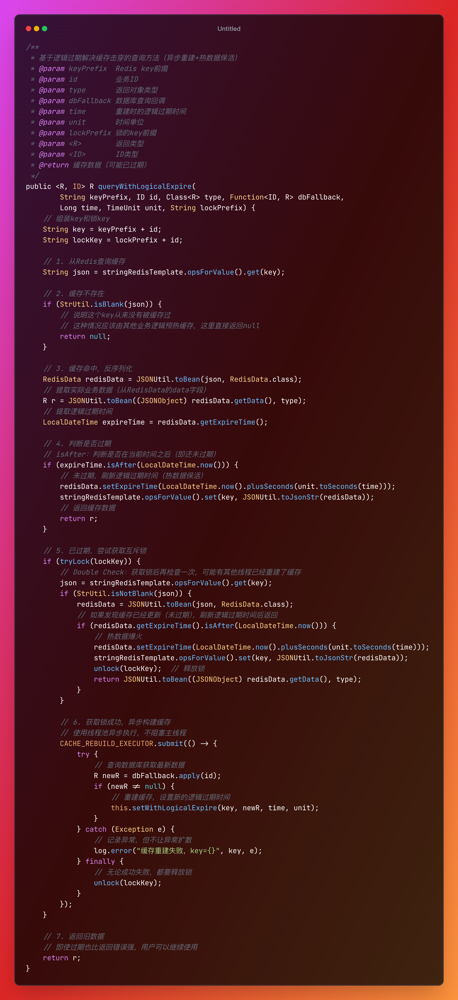

核心思想：**缓存永不过期，但存储一个"逻辑过期时间"**

- 查询时判断是否已逻辑过期
- 如果未过期，直接返回缓存数据
- 如果已过期，尝试获取锁，只让一个线程去重建缓存
- 其他线程直接返回旧数据（不等待）

<br>

**执行流程**：

```plaintext
1. 查询 Redis
   └─ 不存在 → 返回 null（说明从来没有缓存过）
2. 存在，反序列化为 RedisData
3. 判断逻辑过期时间
   └─ 未过期 → 刷新逻辑过期时间后返回（热数据保活）
4. 已过期，尝试获取锁
   ├─ 获取锁失败 → 直接返回旧数据（不等待）
   └─ 获取锁成功 → Double Check 后异步重建
```


<br>


> [!question] 为什么缓存不存在时不去查数据库，而是直接返回 null？

因为 `queryWithLogicalExpire` **这个方法是专为“热点 Key”设计的，它的前提假设是缓存已经“预热”过了**。

<br>

> [!question] 为什么要进行 Double Check（双重检查）？

- 可能有其他线程已经重建了缓存
- 避免重复查询数据库

<br>

> [!question] 为什么返回旧数据？

- 用户体验：比返回错误强
- 数据一致性：热点数据变化不会太频繁
- 异步更新：后台线程很快会更新缓存

<br>

具体代码实现：

