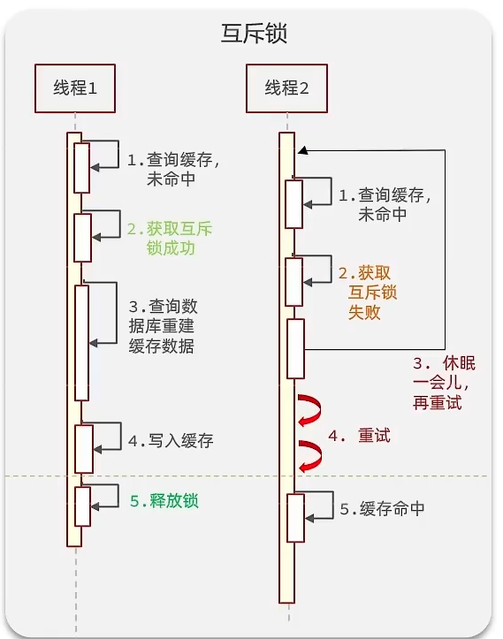
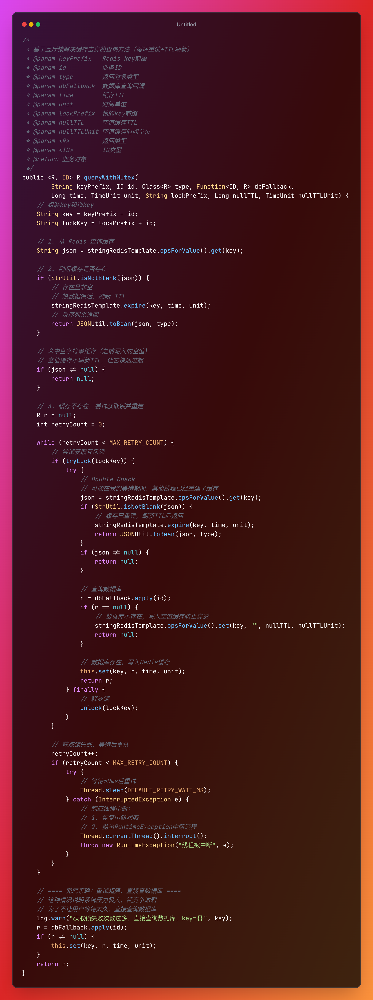

 核心思想：**同一时间只允许一个线程去查询数据库**
- 缓存过期了，大家一起去抢锁
- 抢到锁的线程去查询数据库
- 没抢到锁的线程等待，然后重试
- 抢到锁的线程写完缓存后，其他线程可以直接从缓存读

<br>

举例：
1. 假如线程 1 先来访问，查询缓存没有命中，那么其会获取互斥锁，然后去执行查询数据库的逻辑
2. 线程 2 查询缓存同样没有命中，由于互斥锁已经被占用，所以其无法获取，只能执行 sleep 进行休眠
3. 等到线程 1 释放锁后，线程 2 会被唤醒并获取锁，但是其不是直接查询数据库，而是进行递归来查询缓存


<br>

执行流程：

```plaintext
1. 查询 Redis
   ├─ 存在且非空 → 刷新 TTL 后返回（热数据保活）
   ├─ 存在但为空 → 返回 null（空值缓存，不刷新 TTL）
   └─ 不存在 → 继续步骤 2

2. 循环尝试获取锁（最多 100 次）
   ├─ 获取成功
   │    ├─ Double Check：再查一次 Redis
   │    │    ├─ 缓存已存在 → 刷新 TTL 后返回
   │    │    └─ 缓存仍不存在 → 查数据库并写入缓存
   │    └─ 释放锁
   └─ 获取失败
        └─ 等待 50ms 后重试

3. 重试超限（100 次）→ 直接查数据库作为兜底
```


<br>

代码实现：

