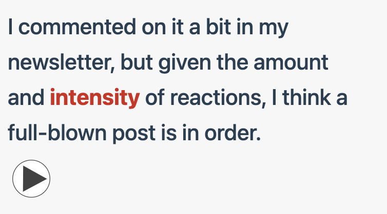
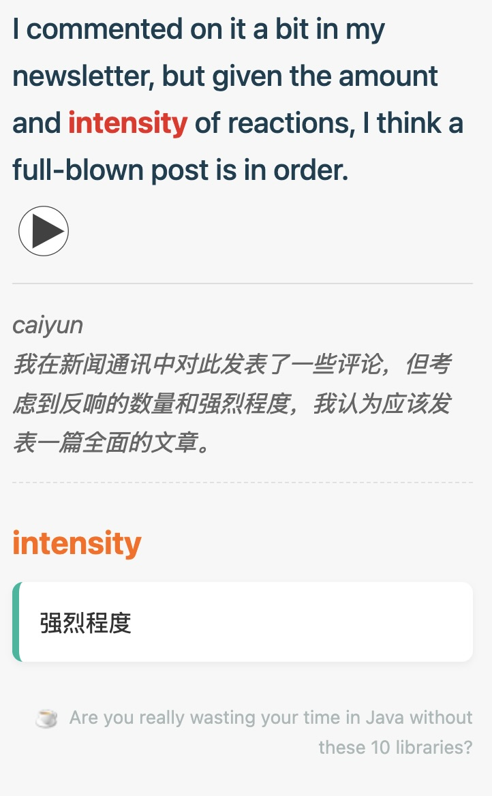

## 传统App痛点


因为存在学习英语的需求，于是去体验了一些市面上传统的背单词APP。不可否认，诸如百词斩、墨墨背单词等App都存在各自的优点，但是长期使用后，发现存在一些实在难以忍受的痛点：

- **脱离语境**：App里的例句往往是预设好的，但是在阅读技术文档或看美剧时遇到的词，那种“当下”的语境感是App无法提供的。
- **被动输入**：这种学习更像是完成任务，而不是为了解决问题。

- **算法的“黑盒”**：对于那些没有记忆而知识简单重复的复习策略，无法掌控真正的复习节奏。有些简单或偏僻的词反复出现浪费时间，而真正优美和常用的词却无法通过自定义权重来加练。


## 新方案


### 沙拉查词


经过一段时间的探索后，总结出了一套**Anki+沙拉查词+HyperTTS**的学习流。


[沙拉查词](https://saladict.crimx.com/)是一个浏览器插件，当阅读网页或PDF时，用来查询指定的单词。


沙拉查词集成了[Anki Connect自动制卡](https://saladict.crimx.com/anki)，它可以直接抓取**当前的上下文（Context）**。这个单词在什么文章里、哪一句话出现的，会被原封不动地带入卡片。这种“强关联”是记忆的捷径。


### Anki


将卡片导入Anki后，我们可以在其中高度自定义自己的卡片模版和样式。


以下是卡片展示效果：

卡片正面：红色的为我们要记忆的生词，可以播放该单词的读音




卡片背面：




以下是卡片模版（天高任鸟飞，可以高度定制）：

正面：

```html
<div class="card-container">
    <div class="context-sentence">{{Context}}</div>
    
    {{#Audio}}{{Audio}}{{/Audio}}
</div>

<script>
    // 获取上下文和单词
    var contextDiv = document.querySelector('.context-sentence');
    var targetWord = "{{Text}}".trim();

    if (contextDiv && targetWord) {
        var text = contextDiv.innerHTML;
        // 创建正则，忽略大小写 (gi)
        var regex = new RegExp("(" + targetWord + ")", "gi");
        // 替换为带高亮的 span
        var newText = text.replace(regex, '<span class="highlight-word">$1</span>');
        contextDiv.innerHTML = newText;
    }
</script>
```


背面：

```html
{{FrontSide}}

<hr id="answer">

<div class="back-container">
    
    {{#Translation}}
    <div class="sentence-translation">{{Translation}}</div>
    {{/Translation}}

    <div class="target-word-header">{{Text}}</div>

    {{#Note}}
    <div class="note-section">
        {{Note}}
    </div>
    {{/Note}}

    {{#Title}}
    <div class="source-section">
        {{#Favicon}}{{/Favicon}}
        <a href="{{Url}}">{{Title}}</a>
    </div>
    {{/Title}}

</div>
```


样式：

```css
.card {
  font-family: -apple-system, BlinkMacSystemFont, "Segoe UI", Roboto, Helvetica, Arial, sans-serif;
  font-size: 20px;
  line-height: 1.6;
  color: #333;
  background-color: #f7f7f7;
  text-align: left;
  padding: 20px;
}

/* 正面：上下文英文句子 */
.context-sentence {
  font-size: 1.2em;
  color: #2c3e50;
  font-weight: 500;
  margin-bottom: 5px;
}

/* 分割线 */
hr {
  border: 0;
  height: 1px;
  background: #ddd;
  margin: 15px 0;
}

/* 背面：句子的中文翻译 */
.sentence-translation {
  font-size: 1em;
  color: #666;
  font-style: italic; /* 用斜体区分翻译 */
  margin-bottom: 25px;
  padding-bottom: 15px;
  border-bottom: 1px dashed #e0e0e0;
}

/* 背面：目标单词标题 */
.target-word-header {
  font-size: 1.5em;
  font-weight: bold;
  color: #e67e22; /* 醒目的橙色 */
  margin-bottom: 10px;
}

/* 背面：笔记区域 (释义与用法) */
.note-section {
  font-size: 1em;
  color: #333;
  background-color: #fff;
  padding: 15px;
  border-radius: 8px;
  box-shadow: 0 2px 5px rgba(0,0,0,0.05); /* 轻微阴影，像一张卡片 */
  border-left: 5px solid #5caf9e; /* 左侧绿色装饰条 */
}

/* 底部来源信息 */
.source-section {
  margin-top: 30px;
  font-size: 0.75em;
  text-align: right;
  opacity: 0.6;
}

.source-section a {
  color: #7f8c8d;
  text-decoration: none;
}

.favicon {
  height: 16px;
  width: 16px;
  vertical-align: middle;
  margin-right: 5px;
}

/* 移动端适配 */
@media (max-width: 600px) {
    .card { padding: 15px; font-size: 18px; }
    .target-word-header { font-size: 1.3em; }
}

.highlight-word {
    color: #c0392b; /* 红色 */
    font-weight: bold;
}
```


### HyperTTS


没有声音的单词是没有灵魂的，而在Anki的广袤插件市场中，[HyperTTS](https://ankiweb.net/shared/info/111623432)可以弥补这一点。


HyperTTS可以调用Azure和Google等神经网络自动生成语音，但是免费的一些官方语音如剑桥也够用了。


以下是一些配置：

- `Source/Source Field`：Text （要生成语音的字段）
- `Target/Target Field`：Audio（语音文件的目标字段）
- `Voice Selection/Voice`：Cambridge（可以自由更换）
